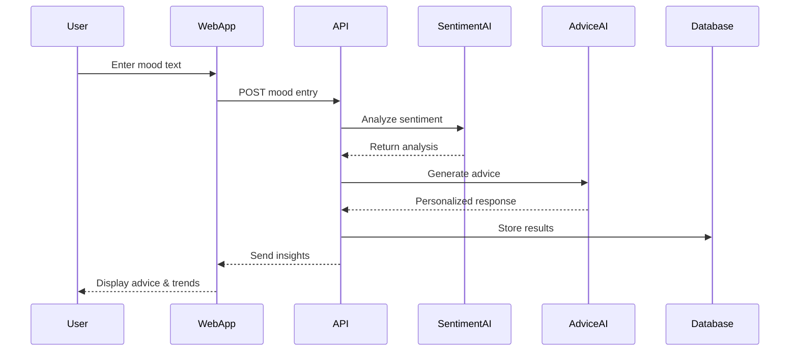

# MomNova - Smart Parenting Assistant 🤱

> AI-powered maternal mental health support platform for Indian mothers

[](https://aws.amazon.com/)
[](https://aws.amazon.com/bedrock/)
[](https://aws.amazon.com/comprehend/)
[](LICENSE)

## 🌟 Overview

**MomNova** addresses the critical maternal mental health crisis in India, where **22% of new mothers** experience postpartum depression, yet **70% never seek help** due to stigma and limited access. Our AI-powered platform provides culturally-sensitive, personalized mental health support through intelligent mood tracking, sentiment analysis, and wellness insights.

### 🎯 Key Features

- **📝 Daily Mood Capture** - Simple text input for emotional check-ins
- **🧠 AI Sentiment Analysis** - Amazon Comprehend for emotion detection
- **💡 Personalized Advice** - Cultural-aware AI guidance using Amazon Bedrock
- **📊 Mood Visualization** - Interactive charts showing emotional patterns
- **🚨 Wellness Alerts** - Early detection of concerning patterns (5+ sad days)
- **🌍 Cultural Intelligence** - Hinglish support and festival-aware advice
- **📱 Progressive Web App** - Mobile-first, offline-capable experience

## 🏗️ Architecture

### Event Flow


### System Components
- **Frontend**: Svelte 4 + Tailwind CSS + Chart.js (PWA)
- **Backend**: .NET 8 Web API with Clean Architecture
- **Database**: Amazon DynamoDB (NoSQL, auto-scaling)
- **AI Services**: Amazon Bedrock (Claude 3) + Amazon Comprehend
- **Deployment**: AWS Elastic Beanstalk with auto-scaling
- **Monitoring**: Amazon CloudWatch

## 🚀 Quick Start

### Prerequisites
- AWS Account with Bedrock access
- .NET 8 SDK
- Node.js 18+
- AWS CLI configured

### Installation

1. **Clone the repository**
   ```bash
   git clone https://github.com/your-username/momnova-smart-parenting.git
   cd momnova-smart-parenting
   ```

2. **Backend Setup**
   ```bash
   cd backend
   dotnet restore
   dotnet build
   ```

3. **Frontend Setup**
   ```bash
   cd frontend
   npm install
   npm run dev
   ```

4. **Configure AWS Services**
   ```bash
   # Set up environment variables
   export AWS_REGION=us-east-1
   export BEDROCK_MODEL_ID=anthropic.claude-3-sonnet-20240229-v1:0
   export DYNAMODB_TABLE_PREFIX=SmartParenting
   ```

5. **Run the Application**
   ```bash
   # Backend
   dotnet run --project SmartParenting.API
   
   # Frontend (new terminal)
   npm run dev
   ```

Visit `http://localhost:5173` to access the application.

## 📱 Usage

### For Mothers
1. **Daily Check-in**: Enter your mood in the text box
   - "Feeling overwhelmed with baby's sleep schedule"
   - "Happy that baby smiled today!"

2. **View Insights**: See your emotional patterns over time
   - Weekly/monthly mood trends
   - Positive vs negative sentiment analysis
   - Wellness pattern detection

3. **Get AI Advice**: Receive personalized, culturally-aware guidance
   - Traditional + modern parenting tips
   - Festival-specific advice
   - Crisis support resources

### Sample User Journey
```
Day 1: "Baby didn't sleep well" → Sentiment: Negative → Advice: Sleep tips
Day 2: "Feeling tired but hopeful" → Sentiment: Mixed → Advice: Self-care
Day 5: Pattern detected → Wellness Alert → Professional resources suggested
```

## 🛠️ Development

### Project Structure
```
momnova-smart-parenting/
├── backend/
│   ├── SmartParenting.API/          # Web API controllers
│   ├── SmartParenting.Application/  # Business logic (CQRS)
│   ├── SmartParenting.Domain/       # Core entities
│   └── SmartParenting.Infrastructure/ # AWS integrations
├── frontend/
│   ├── src/
│   │   ├── components/              # Svelte components
│   │   ├── pages/                   # Application pages
│   │   ├── stores/                  # State management
│   │   └── lib/                     # Utilities
│   └── public/                      # Static assets
├── docs/
│   ├── design.md                    # Technical design
│   ├── requirements.md              # Functional requirements
│   └── hackathon-mvp.md            # MVP scope
└── README.md
```

### API Endpoints
```
POST   /api/mood/capture              # Daily mood entry
GET    /api/analytics/mood-trends     # Mood visualization data
POST   /api/advice/generate           # AI advice generation
GET    /api/journal/entries           # Journal history
POST   /api/auth/register             # User registration
```

### Environment Variables
```bash
# AWS Configuration
AWS_REGION=us-east-1
AWS_ACCESS_KEY_ID=your_access_key
AWS_SECRET_ACCESS_KEY=your_secret_key

# Bedrock Configuration
BEDROCK_MODEL_ID=anthropic.claude-3-sonnet-20240229-v1:0
BEDROCK_REGION=us-east-1

# DynamoDB Configuration
DYNAMODB_TABLE_PREFIX=SmartParenting
DYNAMODB_REGION=us-east-1

# Application Configuration
ASPNETCORE_ENVIRONMENT=Development
CORS_ORIGINS=http://localhost:5173
```

## 🧪 Testing

### Backend Tests
```bash
cd backend
dotnet test
```

### Frontend Tests
```bash
cd frontend
npm run test
```

### Integration Tests
```bash
# Test AWS services connectivity
dotnet test --filter Category=Integration
```

## 📊 Monitoring & Analytics

### CloudWatch Metrics
- API response times (P50, P95, P99)
- Sentiment analysis accuracy
- User engagement rates
- Crisis intervention triggers

### Custom Dashboards
- Daily active users
- Mood trend patterns
- AI advice effectiveness
- System health metrics

## 🌍 Cultural Intelligence

### Supported Languages
- **English**: Primary interface language
- **Hindi**: Native language support
- **Hinglish**: Mixed language processing
- **Tamil**: Regional language (planned)

### Cultural Features
- **Festival Awareness**: Diwali, Holi, regional celebrations
- **Traditional Practices**: Postpartum confinement, joint family dynamics
- **Regional Customization**: Climate, food habits, local customs
- **Ayurvedic Integration**: Traditional remedies alongside modern advice

## 🚨 Crisis Support

### Red Flag Detection
- Severe negative sentiment (>0.8) for 3+ consecutive days
- Crisis keywords: "harm", "hopeless", "can't cope"
- Sudden mood pattern changes

### Intervention Protocols
1. **Immediate**: Display crisis resources and helplines
2. **Escalated**: Suggest professional mental health support
3. **Emergency**: Provide local emergency contact information

### Resources Provided
- National mental health helplines
- Local psychiatrist directories
- Postpartum support groups
- Emergency services contacts

## 🎯 Impact Metrics

### Target Outcomes
- **User Engagement**: 70%+ daily check-in completion rate
- **Mood Improvement**: 60%+ users report better emotional awareness
- **Help-Seeking**: 30%+ increase in professional help requests
- **Early Detection**: 95%+ accuracy in crisis pattern identification

### Success Stories
> *"MomNova helped me understand my emotional patterns and seek help when I needed it most."* - Anonymous User

> *"The cultural sensitivity made me feel understood in a way other apps couldn't."* - Mumbai Mother

## 🤝 Contributing

We welcome contributions! Please see our [Contributing Guidelines](CONTRIBUTING.md).

### Development Workflow
1. Fork the repository
2. Create a feature branch (`git checkout -b feature/amazing-feature`)
3. Commit changes (`git commit -m 'Add amazing feature'`)
4. Push to branch (`git push origin feature/amazing-feature`)
5. Open a Pull Request

### Code Standards
- Follow Clean Architecture principles
- Write unit tests for new features
- Use conventional commit messages
- Ensure AWS security best practices

## 📄 License

This project is licensed under the MIT License - see the [LICENSE](LICENSE) file for details.

## 🏆 Awards & Recognition

- **AWS AI for Bharat Hackathon** - Submission 2025
- **Social Impact**: Addressing UN SDG 3 (Good Health and Well-being)
- **Innovation**: First AI-powered maternal mental health platform for India

## 📞 Support

### For Users
- **Help Center**: [help.momnova.com](https://help.momnova.com)
- **Crisis Support**: National Mental Health Helpline: 1800-599-0019
- **Email**: support@momnova.com

### For Developers
- **Documentation**: [docs.momnova.com](https://docs.momnova.com)
- **Issues**: [GitHub Issues](https://github.com/your-username/momnova-smart-parenting/issues)
- **Discussions**: [GitHub Discussions](https://github.com/your-username/momnova-smart-parenting/discussions)

## 🔮 Roadmap

### Phase 1 (Current)
- ✅ Core mood tracking and sentiment analysis
- ✅ Basic AI advice generation
- ✅ Mood visualization charts

### Phase 2 (Q2 2025)
- 🔄 WhatsApp integration
- 🔄 Voice input support
- 🔄 Multi-language expansion

### Phase 3 (Q3 2025)
- 📋 Healthcare provider integration
- 📋 Community support features
- 📋 Advanced analytics dashboard

### Phase 4 (Q4 2025)
- 📋 Wearable device integration
- 📋 Predictive mental health insights
- 📋 Telemedicine partnerships

---

<div align="center">

**Made with ❤️ for Indian mothers**

[Website](https://momnova.com) • [Documentation](https://docs.momnova.com) • [Support](mailto:support@momnova.com)

</div>
