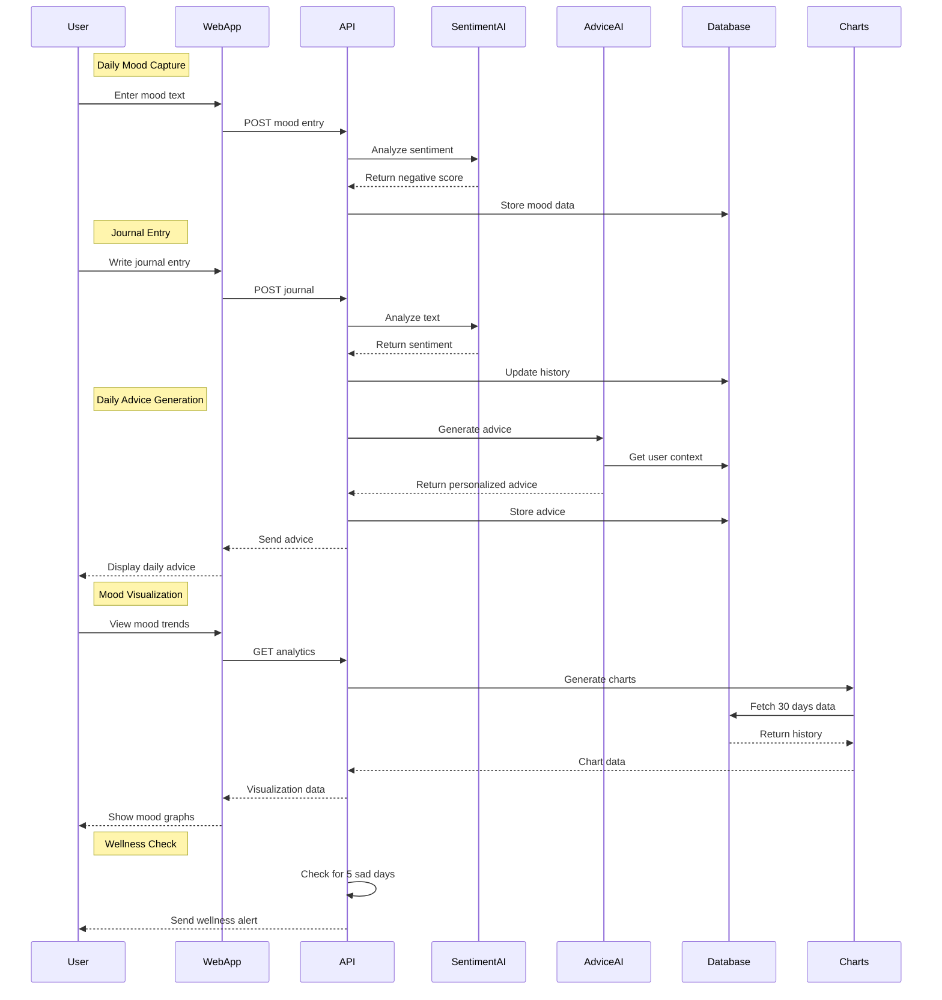
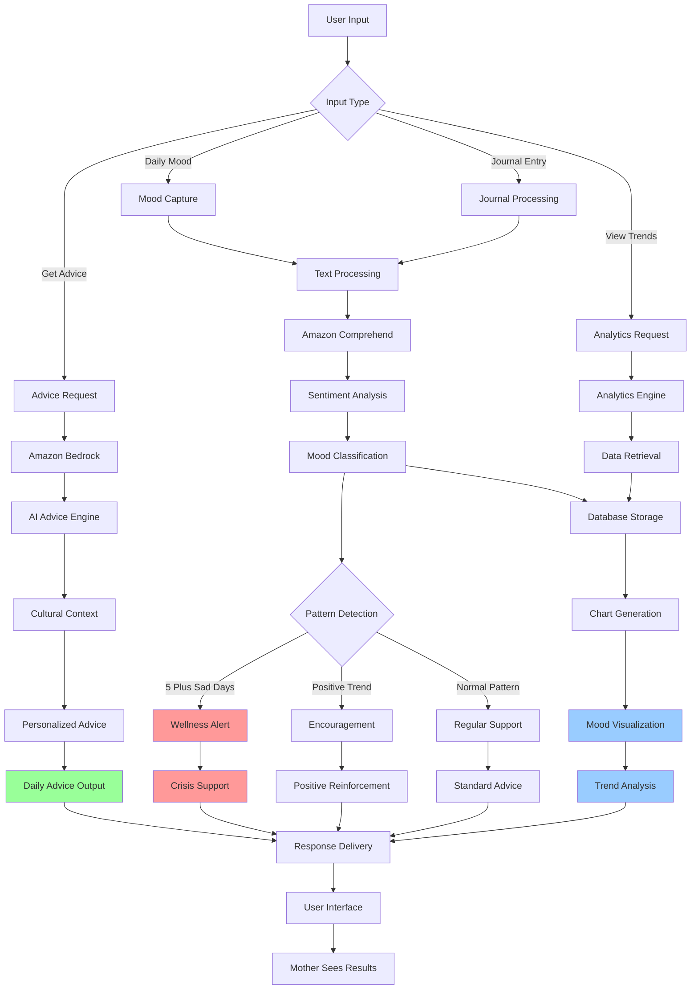

# Design Document: MomNova-Smart Parenting Assistant

## Executive Summary

MomNova-Smart Parenting Assistant is an AI-powered maternal mental health support platform designed to address the critical gap in postpartum mental health care in India. Built using modern cloud-native architecture with AWS services, the system provides culturally-sensitive, personalized support for new mothers through AI-driven sentiment analysis and advice generation.

### Key Architecture Decisions
- **Clean Architecture**: 4-layer separation ensuring maintainability and testability
- **CQRS Pattern**: Command/Query separation for optimal performance
- **Cloud-Native**: AWS services for scalability and reliability
- **AI-First**: Amazon Bedrock and Comprehend for intelligent features
- **Cultural Intelligence**: Hinglish support and festival-aware advice

---

## High-Level Architecture

### Event Flow Architecture



### System Component Flow



---

## Technology Stack Overview

**Frontend**: Svelte 4 + Tailwind CSS + Chart.js (PWA-enabled)
**Backend**: .NET 8 Web API with Clean Architecture
**Database**: Amazon DynamoDB (NoSQL, auto-scaling)
**AI Services**: Amazon Bedrock (Claude 3) + Amazon Comprehend
**Deployment**: AWS Elastic Beanstalk with auto-scaling
**Monitoring**: Amazon CloudWatch

---

## Technology Stack

### Frontend Technologies

| Technology | Version | Purpose |
|------------|---------|---------|
| **Svelte** | 4.x | Reactive UI framework |
| **Vite** | Latest | Build tool and dev server |
| **Tailwind CSS** | 3.x | Utility-first CSS framework |
| **Chart.js** | 4.x | Data visualization |
| **Axios** | Latest | HTTP client |
| **Vite PWA Plugin** | Latest | Progressive Web App features |

### Backend Technologies

| Technology | Version | Purpose |
|------------|---------|---------|
| **.NET** | 8.0 | Runtime and framework |
| **ASP.NET Core** | 8.0 | Web API framework |
| **MediatR** | Latest | CQRS implementation |
| **Semantic Kernel** | Latest | AI orchestration |
| **AWS SDK** | Latest | AWS service integration |

### AWS Services Integration

| Service | Purpose | Configuration |
|---------|---------|---------------|
| **Amazon Bedrock** | AI advice generation | Claude 3 Sonnet model |
| **Amazon Comprehend** | Sentiment analysis | English/Hindi support |
| **Amazon DynamoDB** | NoSQL database | On-demand billing |
| **Amazon Cognito** | Authentication | User Pools |
| **AWS Elastic Beanstalk** | Application hosting | Auto-scaling 1-10 instances |
| **Amazon CloudWatch** | Monitoring & logging | Custom metrics & alarms |
| **Amazon S3** | Static assets (optional) | Standard storage class |
| **AWS Certificate Manager** | SSL/TLS certificates | Auto-renewal |
| **Amazon Q Developer** | Development assistance | Code generation support |

---

## Clean Architecture Layers

### Layer 1: API (SmartParenting.API)

**Responsibilities**: HTTP request handling, authentication, validation, response formatting

```
SmartParenting.API/
├── Controllers/
│   ├── AuthController.cs          # Authentication endpoints
│   ├── BabyController.cs          # Baby profile management
│   ├── JournalController.cs       # Journal entry CRUD
│   ├── DailyAdviceController.cs   # AI advice generation
│   ├── SentimentAnalysisController.cs # Sentiment endpoints
│   └── HealthController.cs        # Health checks
├── Middleware/
│   ├── ExceptionHandlingMiddleware.cs # Global error handling
│   ├── AuthenticationMiddleware.cs    # JWT validation
│   └── LoggingMiddleware.cs           # Request/response logging
├── Program.cs                     # Application startup
└── appsettings.json              # Configuration
```

### Layer 2: Application (SmartParenting.Application)

**Responsibilities**: Business logic orchestration, CQRS implementation, DTOs

```
SmartParenting.Application/
├── Commands/                      # CQRS Commands
│   ├── CreateJournalEntryCommand.cs
│   ├── GenerateDailyAdviceCommand.cs
│   ├── CreateBabyProfileCommand.cs
│   └── UpdateUserPreferencesCommand.cs
├── Queries/                       # CQRS Queries
│   ├── GetJournalEntriesQuery.cs
│   ├── GetMoodTrendsQuery.cs
│   ├── GetDailyAdviceQuery.cs
│   └── GetBabyProfilesQuery.cs
├── Handlers/                      # MediatR Handlers
│   ├── CreateJournalEntryCommandHandler.cs
│   ├── GenerateDailyAdviceCommandHandler.cs
│   └── GetMoodTrendsQueryHandler.cs
├── DTOs/                          # Data Transfer Objects
│   ├── JournalEntryDto.cs
│   ├── BabyProfileDto.cs
│   ├── DailyAdviceDto.cs
│   └── SentimentAnalysisDto.cs
└── Interfaces/                    # Service contracts
    ├── IDataService.cs
    ├── ISentimentAnalysisService.cs
    └── ISmartParentingKernelService.cs
```

### Layer 3: Domain (SmartParenting.Domain)

**Responsibilities**: Core business entities, value objects, domain logic

```
SmartParenting.Domain/
├── Entities/                      # Domain entities
│   ├── User.cs                    # User aggregate root
│   ├── BabyProfile.cs            # Baby information
│   ├── JournalEntry.cs           # Daily journal entries
│   ├── DailyAdvice.cs            # AI-generated advice
│   └── SentimentHistory.cs       # Sentiment tracking
├── ValueObjects/                  # Immutable value objects
│   ├── SentimentScore.cs         # Sentiment analysis results
│   ├── MoodLevel.cs              # Mood enumeration
│   └── CulturalContext.cs        # Regional/cultural data
└── Enums/                        # Domain enumerations
    ├── Gender.cs
    ├── FeedingType.cs
    ├── SentimentType.cs
    └── MoodType.cs
```

### Layer 4: Infrastructure (SmartParenting.Infrastructure)

**Responsibilities**: External service integration, data persistence, AI services

```
SmartParenting.Infrastructure/
├── AI/                           # AI service implementations
│   ├── SemanticKernelService.cs  # AI orchestration
│   ├── BedrockChatCompletionService.cs # Bedrock integration
│   ├── PromptyService.cs         # Prompt template handling
│   └── SentimentAnalysisService.cs # Comprehend integration
├── Data/                         # Data access layer
│   ├── DynamoDbService.cs        # DynamoDB client
│   └── Repositories/             # Repository implementations
│       ├── BabyRepository.cs
│       ├── JournalRepository.cs
│       └── AdviceRepository.cs
├── AWS/                          # AWS service clients
│   ├── CognitoService.cs         # Authentication service
│   ├── CloudWatchService.cs      # Monitoring service
│   └── S3Service.cs              # File storage (optional)
└── Prompts/                      # AI prompt templates
    ├── DailyAdvice.prompty       # Daily advice generation
    ├── EmotionalSupport.prompty  # Crisis support
    └── CulturalAdvice.prompty    # Festival-aware advice
```

---

## Database Design (Amazon DynamoDB)

### Design Rationale

**Why DynamoDB?**
- **Serverless**: Fully managed, no infrastructure overhead
- **Auto-scaling**: On-demand pricing scales with usage
- **Performance**: Single-digit millisecond latency
- **Security**: Built-in encryption and IAM integration
- **Reliability**: 99.99% availability SLA

### Table Schemas

#### Table 1: Users

```json
{
  "TableName": "SmartParenting_Users",
  "KeySchema": [
    {
      "AttributeName": "userId",
      "KeyType": "HASH"
    }
  ],
  "AttributeDefinitions": [
    {
      "AttributeName": "userId",
      "AttributeType": "S"
    },
    {
      "AttributeName": "email",
      "AttributeType": "S"
    }
  ],
  "GlobalSecondaryIndexes": [
    {
      "IndexName": "email-index",
      "KeySchema": [
        {
          "AttributeName": "email",
          "KeyType": "HASH"
        }
      ]
    }
  ],
  "BillingMode": "PAY_PER_REQUEST"
}
```

**Example Item:**
```json
{
  "userId": "user_abc123",
  "email": "priya@example.com",
  "name": "Priya Baskaran",
  "location": "Chennai, Tamil Nadu",
  "language": "English",
  "createdAt": "2025-01-15T10:30:00Z",
  "preferences": {
    "notificationsEnabled": true,
    "region": "South India"
  }
}
```

#### Table 2: BabyProfiles

```json
{
  "TableName": "SmartParenting_BabyProfiles",
  "KeySchema": [
    {
      "AttributeName": "userId",
      "KeyType": "HASH"
    },
    {
      "AttributeName": "babyId",
      "KeyType": "RANGE"
    }
  ],
  "AttributeDefinitions": [
    {
      "AttributeName": "userId",
      "AttributeType": "S"
    },
    {
      "AttributeName": "babyId",
      "AttributeType": "S"
    }
  ],
  "BillingMode": "PAY_PER_REQUEST"
}
```

**Example Item:**
```json
{
  "userId": "user_abc123",
  "babyId": "baby_xyz789",
  "name": "Aarav",
  "dateOfBirth": "2024-06-15",
  "gender": "male",
  "feedingType": "breastfeeding",
  "createdAt": "2025-01-15T10:35:00Z",
  "milestones": [
    {
      "type": "first_smile",
      "date": "2024-08-01"
    }
  ]
}
```

#### Table 3: JournalEntries

```json
{
  "TableName": "SmartParenting_JournalEntries",
  "KeySchema": [
    {
      "AttributeName": "userId",
      "KeyType": "HASH"
    },
    {
      "AttributeName": "timestamp",
      "KeyType": "RANGE"
    }
  ],
  "AttributeDefinitions": [
    {
      "AttributeName": "userId",
      "AttributeType": "S"
    },
    {
      "AttributeName": "timestamp",
      "AttributeType": "N"
    },
    {
      "AttributeName": "date",
      "AttributeType": "S"
    }
  ],
  "GlobalSecondaryIndexes": [
    {
      "IndexName": "date-index",
      "KeySchema": [
        {
          "AttributeName": "userId",
          "KeyType": "HASH"
        },
        {
          "AttributeName": "date",
          "KeyType": "RANGE"
        }
      ]
    }
  ],
  "BillingMode": "PAY_PER_REQUEST"
}
```

**Example Item:**
```json
{
  "userId": "user_abc123",
  "timestamp": 1737414600,
  "entryId": "entry_def456",
  "date": "2025-01-20",
  "content": "Baby didn't sleep well tonight. Feeling exhausted and overwhelmed.",
  "mood": "tired",
  "sentiment": "NEGATIVE",
  "sentimentScores": {
    "positive": 0.05,
    "negative": 0.85,
    "neutral": 0.08,
    "mixed": 0.02
  },
  "confidenceScore": 0.92,
  "language": "en",
  "babyId": "baby_xyz789",
  "createdAt": "2025-01-20T22:30:00Z"
}
```

#### Table 4: DailyAdvice

```json
{
  "TableName": "SmartParenting_DailyAdvice",
  "KeySchema": [
    {
      "AttributeName": "userId",
      "KeyType": "HASH"
    },
    {
      "AttributeName": "date",
      "KeyType": "RANGE"
    }
  ],
  "BillingMode": "PAY_PER_REQUEST"
}
```

**Example Item:**
```json
{
  "userId": "user_abc123",
  "date": "2025-01-20",
  "adviceId": "advice_ghi789",
  "babyId": "baby_xyz789",
  "adviceText": "At 7 months, Aarav is exploring the world! Try tummy time to strengthen those muscles. चिंता मत करो - every baby develops at their own pace. You're doing great! 💪",
  "generatedAt": "2025-01-20T06:00:00Z",
  "read": false
}
```

#### Table 5: SentimentHistory

```json
{
  "TableName": "SmartParenting_SentimentHistory",
  "KeySchema": [
    {
      "AttributeName": "userId",
      "KeyType": "HASH"
    },
    {
      "AttributeName": "date",
      "KeyType": "RANGE"
    }
  ],
  "BillingMode": "PAY_PER_REQUEST"
}
```

**Example Item:**
```json
{
  "userId": "user_abc123",
  "date": "2025-01-20",
  "aggregatedSentiment": "NEGATIVE",
  "averageScore": 0.35,
  "entryCount": 2,
  "dominantMood": "tired",
  "concerningPattern": true
}
```

### Access Patterns & Data Isolation

**Primary Access Patterns:**
1. **Get user profile**: Query Users table by userId (partition key)
2. **Get all babies for user**: Query BabyProfiles by userId
3. **Get journal entries (date range)**: Query JournalEntries GSI (date-index) with userId + date range
4. **Get daily advice**: Query DailyAdvice by userId + date
5. **Get sentiment trends (last 30 days)**: Query SentimentHistory by userId + date range

**Data Isolation Strategy:**
- All tables partitioned by `userId`
- Each user's data is completely isolated
- Queries automatically filtered by authenticated userId
- No cross-user data access possible

---

## API Design (RESTful)

### Authentication Endpoints

```
POST   /api/auth/register
POST   /api/auth/login
POST   /api/auth/logout
POST   /api/auth/refresh
GET    /api/auth/verify
```

**Example: POST /api/auth/register**
```json
Request:
{
  "email": "priya@example.com",
  "password": "SecureP@ss123",
  "name": "Priya Baskaran",
  "location": "Chennai, Tamil Nadu"
}

Response: 201 Created
{
  "userId": "user_abc123",
  "accessToken": "eyJhbGc...",
  "refreshToken": "eyJhbGc...",
  "expiresIn": 900
}
```

### Baby Management Endpoints

```
GET    /api/babies
POST   /api/babies
GET    /api/babies/{babyId}
PUT    /api/babies/{babyId}
DELETE /api/babies/{babyId}
```

**Example: POST /api/babies**
```json
Request:
{
  "name": "Aarav",
  "dateOfBirth": "2024-06-15",
  "gender": "male",
  "feedingType": "breastfeeding"
}

Response: 201 Created
{
  "babyId": "baby_xyz789",
  "userId": "user_abc123",
  "name": "Aarav",
  "dateOfBirth": "2024-06-15",
  "ageInMonths": 7,
  "gender": "male",
  "feedingType": "breastfeeding",
  "createdAt": "2025-01-20T10:00:00Z"
}
```

### Journal Endpoints

```
POST   /api/journal/entries
GET    /api/journal/entries
GET    /api/journal/entries/{entryId}
PUT    /api/journal/entries/{entryId}
DELETE /api/journal/entries/{entryId}
```

**Example: POST /api/journal/entries**
```json
Request:
{
  "content": "Baby slept through the night! Feeling relieved and happy.",
  "mood": "happy",
  "babyId": "baby_xyz789"
}

Response: 201 Created
{
  "entryId": "entry_def456",
  "userId": "user_abc123",
  "content": "Baby slept through the night! Feeling relieved and happy.",
  "mood": "happy",
  "sentiment": "POSITIVE",
  "sentimentScores": {
    "positive": 0.95,
    "negative": 0.02,
    "neutral": 0.02,
    "mixed": 0.01
  },
  "confidenceScore": 0.98,
  "language": "en",
  "timestamp": 1737414700,
  "createdAt": "2025-01-20T22:45:00Z"
}
```

### Advice Endpoints

```
GET    /api/advice/daily/{babyId}
POST   /api/advice/generate/{babyId}
GET    /api/advice/history
```

### Analytics Endpoints

```
GET    /api/analytics/mood-trends?startDate=YYYY-MM-DD&endDate=YYYY-MM-DD
GET    /api/analytics/sentiment-summary
GET    /api/analytics/weekly-report
```

**Example: GET /api/analytics/mood-trends**
```json
Response: 200 OK
{
  "startDate": "2025-01-01",
  "endDate": "2025-01-20",
  "dataPoints": [
    {
      "date": "2025-01-20",
      "sentiment": "POSITIVE",
      "score": 0.85,
      "entryCount": 1
    },
    {
      "date": "2025-01-19",
      "sentiment": "NEGATIVE",
      "score": 0.35,
      "entryCount": 2
    }
  ],
  "averageSentiment": 0.60,
  "trend": "improving"
}
```

---

## AI Integration Architecture

### Amazon Bedrock Integration (Claude 3 Sonnet)

**Daily Advice Generation Flow:**

```
User Request
    ↓
.NET API Controller
    ↓
Application Layer (CQRS Handler)
    ↓
┌────────────────────────────────────┐
│  Semantic Kernel Orchestration     │
│                                    │
│  1. Fetch context:                 │
│     - Baby details (DynamoDB)      │
│     - Recent journal entries       │
│     - Past mood trends             │
│     - User preferences             │
│                                    │
│  2. Load Prompty template:         │
│     - DailyAdvice.prompty          │
│                                    │
│  3. Render template:               │
│     {{babyName}} → "Aarav"         │
│     {{babyAge}} → "7 months"       │
│     {{recentMood}} → "tired"       │
│     {{location}} → "Chennai"       │
│                                    │
│  4. Send to Bedrock:               │
│     - Model: Claude 3 Sonnet       │
│     - Temperature: 0.7             │
│     - Max Tokens: 2000             │
└────────────┬───────────────────────┘
             │
             ▼
    ┌──────────────────┐
    │  Amazon Bedrock  │
    │  (Claude 3)      │
    │                  │
    │  Generates       │
    │  personalized    │
    │  advice with     │
    │  cultural        │
    │  context         │
    └────────┬─────────┘
             │
             ▼
    ┌─────────────────────┐
    │  Post-processing    │
    │  - Validate content │
    │  - Check length     │
    │  - Filter profanity │
    └─────────┬───────────┘
             │
             ▼
    ┌────────────────────┐
    │  Store in DynamoDB │
    │  (DailyAdvice)     │
    └─────────┬──────────┘
             │
             ▼
        Return to user
```

**Code Implementation:**

```csharp
// BedrockChatCompletionService.cs
public class BedrockChatCompletionService : IChatCompletionService
{
    private readonly IAmazonBedrockRuntime _bedrockClient;
    private readonly string _modelId = "anthropic.claude-3-sonnet-20240229-v1:0";

    public async Task<ChatMessageContent> GetChatMessageContentAsync(
        ChatHistory chatHistory,
        PromptExecutionSettings? executionSettings = null,
        Kernel? kernel = null,
        CancellationToken cancellationToken = default)
    {
        var settings = BedrockPromptExecutionSettings.FromExecutionSettings(executionSettings);
        
        var requestBody = new
        {
            anthropic_version = "bedrock-2023-05-31",
            max_tokens = settings.MaxTokens,
            temperature = settings.Temperature,
            messages = ConvertChatHistory(chatHistory)
        };

        var request = new InvokeModelRequest
        {
            ModelId = _modelId,
            ContentType = "application/json",
            Accept = "application/json",
            Body = new MemoryStream(Encoding.UTF8.GetBytes(JsonSerializer.Serialize(requestBody)))
        };

        var response = await _bedrockClient.InvokeModelAsync(request, cancellationToken);
        var responseBody = await new StreamReader(response.Body).ReadToEndAsync();
        var claudeResponse = JsonSerializer.Deserialize<ClaudeResponse>(responseBody);

        return new ChatMessageContent(
            role: AuthorRole.Assistant,
            content: claudeResponse.Content.First().Text);
    }
}
```

**Prompty Template Example:**

```yaml
---
name: Daily Baby Advice
description: Generates culturally-appropriate daily parenting advice
model:
  api: chat
  configuration:
    type: amazon_bedrock
    model: anthropic.claude-3-sonnet-20240229-v1:0
    parameters:
      max_tokens: 2000
      temperature: 0.7
---
system:
You are an experienced Indian pediatric advisor with deep knowledge of:
- Traditional Indian parenting practices
- Modern evidence-based childcare
- Cultural sensitivities (festivals, joint families, regional variations)
- Multilingual communication (English, Hindi, Hinglish)

Your advice should be warm, empathetic, supportive, and culturally appropriate.

user:
Please provide daily parenting advice for:

**Baby Details:**
- Name: {{babyName}}
- Age: {{babyAge}}
- Gender: {{gender}}
- Feeding: {{feedingType}}

**Context:**
- Parent's recent mood: {{recentMood}}
- Location: {{location}}
- Current festival/season: {{festivalContext}}

Generate warm, personalized advice (3-4 sentences) that combines traditional wisdom with modern recommendations. Use Hinglish naturally if appropriate for the location.
```

### Amazon Comprehend Integration

**Sentiment Analysis Flow:**

```
Journal Entry Text
    ↓
.NET API receives POST /api/journal/entries
    ↓
Application Layer Handler
    ↓
┌────────────────────────────────────┐
│  SentimentAnalysisService          │
│                                    │
│  1. Prepare request:               │
│     - Text: journal content        │
│     - LanguageCode: auto-detect    │
│                                    │
│  2. Call Comprehend:               │
│     DetectSentimentAsync()         │
└────────────┬───────────────────────┘
             │
             ▼
    ┌──────────────────────┐
    │  Amazon Comprehend   │
    │                      │
    │  Analyzes:           │
    │  - Sentiment         │
    │  - Confidence scores │
    │  - Language          │
    └────────┬─────────────┘
             │
             ▼
    ┌─────────────────────────┐
    │  Response:              │
    │  {                      │
    │    Sentiment: POSITIVE, │
    │    Scores: {            │
    │      Positive: 0.95,    │
    │      Negative: 0.02,    │
    │      Neutral: 0.02,     │
    │      Mixed: 0.01        │
    │    },                   │
    │    Language: "en"       │
    │  }                      │
    └─────────┬───────────────┘
             │
             ▼
    ┌────────────────────────┐
    │  Store with entry      │
    │  (DynamoDB)            │
    └─────────┬──────────────┘
             │
             ▼
    ┌────────────────────────┐
    │  Check for concerning  │
    │  pattern:              │
    │  - If 3+ negative days │
    │    → Trigger advice    │
    │  - If severe words     │
    │    → Show resources    │
    └────────────────────────┘
```

**Code Implementation:**

```csharp
// SentimentAnalysisService.cs
public class ComprehendSentimentService : ISentimentAnalysisService
{
    private readonly IAmazonComprehend _comprehendClient;

    public async Task<SentimentResult> AnalyzeAsync(string text)
    {
        var request = new DetectSentimentRequest
        {
            Text = text,
            LanguageCode = "en" // or auto-detect
        };

        var response = await _comprehendClient.DetectSentimentAsync(request);

        return new SentimentResult
        {
            Sentiment = response.Sentiment.Value,
            Scores = new SentimentScores
            {
                Positive = response.SentimentScore.Positive,
                Negative = response.SentimentScore.Negative,
                Neutral = response.SentimentScore.Neutral,
                Mixed = response.SentimentScore.Mixed
            },
            Confidence = GetMaxConfidence(response.SentimentScore),
            Language = "en"
        };
    }
}
```

---

## Frontend Architecture

### Component Hierarchy

```
App.svelte
├── Router.svelte
├── Layout/
│   ├── Header.svelte
│   ├── Navigation.svelte
│   └── Footer.svelte
├── Pages/
│   ├── Dashboard.svelte
│   ├── Journal/
│   │   ├── JournalList.svelte
│   │   ├── JournalEntry.svelte
│   │   └── JournalForm.svelte
│   ├── Baby/
│   │   ├── BabyProfile.svelte
│   │   └── BabyForm.svelte
│   ├── Analytics/
│   │   ├── MoodTrends.svelte
│   │   └── SentimentChart.svelte
│   └── Settings/
│       ├── UserSettings.svelte
│       └── Preferences.svelte
├── Components/
│   ├── UI/
│   │   ├── Button.svelte
│   │   ├── Input.svelte
│   │   ├── Modal.svelte
│   │   └── Loading.svelte
│   ├── Charts/
│   │   ├── LineChart.svelte
│   │   ├── BarChart.svelte
│   │   └── PieChart.svelte
│   └── Forms/
│       ├── JournalEntryForm.svelte
│       └── BabyProfileForm.svelte
└── Stores/
    ├── auth.js
    ├── journal.js
    ├── baby.js
    └── analytics.js
```

### State Management

**Svelte Stores Implementation:**

```javascript
// stores/auth.js
import { writable } from 'svelte/store';

export const user = writable(null);
export const isAuthenticated = writable(false);
export const accessToken = writable(null);

// stores/journal.js
import { writable } from 'svelte/store';

export const journalEntries = writable([]);
export const currentEntry = writable(null);
export const isLoading = writable(false);

// stores/analytics.js
import { writable } from 'svelte/store';

export const moodTrends = writable([]);
export const sentimentSummary = writable(null);
export const chartData = writable(null);
```

### PWA Configuration

**vite.config.js:**
```javascript
import { defineConfig } from 'vite';
import { svelte } from '@sveltejs/vite-plugin-svelte';
import { VitePWA } from 'vite-plugin-pwa';

export default defineConfig({
  plugins: [
    svelte(),
    VitePWA({
      registerType: 'autoUpdate',
      workbox: {
        globPatterns: ['**/*.{js,css,html,ico,png,svg}']
      },
      manifest: {
        name: 'Smart Parenting Assistant',
        short_name: 'SmartParenting',
        description: 'AI-powered maternal mental health support',
        theme_color: '#4f46e5',
        background_color: '#ffffff',
        display: 'standalone',
        icons: [
          {
            src: 'icon-192x192.png',
            sizes: '192x192',
            type: 'image/png'
          },
          {
            src: 'icon-512x512.png',
            sizes: '512x512',
            type: 'image/png'
          }
        ]
      }
    })
  ]
});
```

---

## Security Design

### Authentication Flow (Amazon Cognito)

```
1. User Registration:
   User → Frontend → API → Cognito.SignUpAsync()
   → Sends verification email
   User confirms email → Cognito.ConfirmSignUpAsync()

2. User Login:
   User enters credentials → API → Cognito.InitiateAuthAsync()
   → Returns JWT tokens

3. API Request:
   Frontend → API (with Authorization: Bearer <token>)
   → Middleware validates JWT
   → Extracts userId from token
   → Proceed with request

4. Token Refresh:
   Access token expires (15 min) → Frontend → API → Cognito.RefreshTokenAsync()
   → Returns new access token
```

**Code Implementation:**

```csharp
// CognitoService.cs
public class CognitoService : IAuthService
{
    private readonly IAmazonCognitoIdentityProvider _cognitoClient;
    private readonly string _userPoolId;
    private readonly string _clientId;

    public async Task<AuthResult> LoginAsync(string email, string password)
    {
        var authRequest = new InitiateAuthRequest
        {
            ClientId = _clientId,
            AuthFlow = AuthFlowType.USER_PASSWORD_AUTH,
            AuthParameters = new Dictionary<string, string>
            {
                { "USERNAME", email },
                { "PASSWORD", password }
            }
        };

        var response = await _cognitoClient.InitiateAuthAsync(authRequest);

        return new AuthResult
        {
            AccessToken = response.AuthenticationResult.AccessToken,
            RefreshToken = response.AuthenticationResult.RefreshToken,
            ExpiresIn = response.AuthenticationResult.ExpiresIn
        };
    }
}

// AuthenticationMiddleware.cs
public class JwtAuthenticationMiddleware
{
    public async Task InvokeAsync(HttpContext context, RequestDelegate next)
    {
        var token = context.Request.Headers["Authorization"]
            .FirstOrDefault()?.Replace("Bearer ", "");

        if (!string.IsNullOrEmpty(token))
        {
            var handler = new JwtSecurityTokenHandler();
            var jwtToken = handler.ReadJwtToken(token);

            // Extract userId from token claims
            var userId = jwtToken.Claims.FirstOrDefault(c => c.Type == "sub")?.Value;

            // Add to HttpContext for controllers to access
            context.Items["UserId"] = userId;
        }

        await next(context);
    }
}
```

### Data Encryption

**At Rest:**
- DynamoDB: Default encryption with AWS-managed keys
- S3 (if used): Server-side encryption (SSE-S3)

**In Transit:**
- All API calls: HTTPS/TLS 1.3
- AWS services: Encrypted by default

**Application Level:**
- Passwords: Hashed (handled by Cognito)
- Sensitive fields: No PII sent to Bedrock

---

## Deployment Architecture

### AWS Elastic Beanstalk Configuration

**Backend (.NET 8 API):**

```yaml
# .ebextensions/environment.config
option_settings:
  aws:elasticbeanstalk:environment:
    EnvironmentType: LoadBalanced
    LoadBalancerType: application
  aws:autoscaling:launchconfiguration:
    InstanceType: t3.small
  aws:autoscaling:asg:
    MinSize: 1
    MaxSize: 10
  aws:autoscaling:trigger:
    MeasureName: CPUUtilization
    Statistic: Average
    Unit: Percent
    UpperThreshold: 70
    LowerThreshold: 30
  aws:elasticbeanstalk:application:environment:
    ASPNETCORE_ENVIRONMENT: Production
    AWS__Region: us-east-1
    AWS__Bedrock__ModelId: anthropic.claude-3-sonnet-20240229-v1:0
```

**Frontend (Svelte):**

```yaml
# Can deploy as static site or Node.js server
option_settings:
  aws:elasticbeanstalk:environment:
    EnvironmentType: LoadBalanced
  aws:autoscaling:launchconfiguration:
    InstanceType: t3.micro
  aws:autoscaling:asg:
    MinSize: 1
    MaxSize: 5
```

### CI/CD Pipeline (GitHub Actions)

```yaml
# .github/workflows/deploy.yml
name: Deploy to AWS Elastic Beanstalk

on:
  push:
    branches: [main]

jobs:
  test:
    runs-on: ubuntu-latest
    steps:
      - uses: actions/checkout@v3
      - name: Run tests
        run: dotnet test

  deploy-backend:
    needs: test
    runs-on: ubuntu-latest
    steps:
      - uses: actions/checkout@v3
      - name: Build
        run: dotnet publish -c Release
      - name: Deploy to EB
        uses: einaregilsson/beanstalk-deploy@v20
        with:
          aws_access_key: ${{ secrets.AWS_ACCESS_KEY_ID }}
          aws_secret_key: ${{ secrets.AWS_SECRET_ACCESS_KEY }}
          application_name: smartparenting-api
          environment_name: production
          version_label: ${{ github.sha }}
          region: us-east-1
          deployment_package: deploy.zip

  deploy-frontend:
    needs: test
    runs-on: ubuntu-latest
    steps:
      - uses: actions/checkout@v3
      - name: Build
        run: npm run build
      - name: Deploy to EB
        uses: einaregilsson/beanstalk-deploy@v20
        with:
          application_name: smartparenting-frontend
          environment_name: production
          # ... additional configuration
```

---

## Monitoring & Observability

### Amazon CloudWatch Integration

**Metrics Tracked:**
- API latency (P50, P95, P99)
- Error rates
- Bedrock API calls per minute
- Comprehend API calls per minute
- DynamoDB read/write capacity
- EC2 instance CPU/memory
- Active user sessions

**Custom Metrics:**
```csharp
// CloudWatchService.cs
public class CloudWatchService
{
    private readonly IAmazonCloudWatch _cloudWatchClient;

    public async Task PutMetricAsync(string metricName, double value, string unit = "Count")
    {
        var request = new PutMetricDataRequest
        {
            Namespace = "SmartParenting",
            MetricData = new List<MetricDatum>
            {
                new MetricDatum
                {
                    MetricName = metricName,
                    Value = value,
                    Unit = unit,
                    Timestamp = DateTime.UtcNow
                }
            }
        };

        await _cloudWatchClient.PutMetricDataAsync(request);
    }
}
```

**Logs:**
- Application logs (structured JSON)
- Access logs (request/response)
- Error logs (exceptions, stack traces)

---

## Performance Optimization

### Backend Optimizations

```csharp
// Connection pooling for DynamoDB
services.AddSingleton<IAmazonDynamoDB>(provider =>
{
    var config = new AmazonDynamoDBConfig
    {
        MaxConnectionsPerServer = 50,
        Timeout = TimeSpan.FromSeconds(30)
    };
    return new AmazonDynamoDBClient(config);
});

// Response caching (future: Redis)
services.AddMemoryCache();

// Async/await throughout
public async Task<IActionResult> GetJournalEntriesAsync()
{
    var entries = await _journalService.GetEntriesAsync();
    return Ok(entries);
}

// Pagination for large datasets
public async Task<PagedResult<JournalEntry>> GetEntriesAsync(int page, int pageSize)
{
    // Implementation with DynamoDB pagination
}
```

### Frontend Optimizations

```javascript
// Code splitting
const JournalPage = lazy(() => import('./pages/Journal.svelte'));
const AnalyticsPage = lazy(() => import('./pages/Analytics.svelte'));

// Lazy loading of routes
const routes = {
  '/journal': wrap({
    asyncComponent: () => import('./pages/Journal.svelte')
  }),
  '/analytics': wrap({
    asyncComponent: () => import('./pages/Analytics.svelte')
  })
};

// Debouncing user input
import { debounce } from 'lodash-es';

const debouncedSearch = debounce((query) => {
  // Search implementation
}, 300);
```

### Database Optimizations

- **Partition key design**: userId for optimal distribution
- **GSI for common queries**: date-index for time-based queries
- **On-demand billing**: Auto-scales with usage
- **Efficient queries**: Single-table design where possible

---

## Error Handling & Resilience

### Graceful Degradation

```csharp
// Example: Graceful degradation
public async Task<string> GetDailyAdviceAsync(string babyId)
{
    try
    {
        // Try Bedrock
        return await _bedrockService.GenerateAdviceAsync(babyId);
    }
    catch (BedrockException ex)
    {
        _logger.LogWarning(ex, "Bedrock unavailable, using cached advice");
        
        // Fallback: Use cached advice
        return await _cache.GetLastAdviceAsync(babyId);
    }
}
```

### Retry Strategies

```csharp
// Exponential backoff for AWS services
services.AddHttpClient<BedrockService>()
    .AddPolicyHandler(GetRetryPolicy());

private static IAsyncPolicy<HttpResponseMessage> GetRetryPolicy()
{
    return HttpPolicyExtensions
        .HandleTransientHttpError()
        .WaitAndRetryAsync(
            retryCount: 3,
            sleepDurationProvider: retryAttempt => 
                TimeSpan.FromSeconds(Math.Pow(2, retryAttempt)));
}
```

### Circuit Breakers

```csharp
// Circuit breaker for external services
services.AddHttpClient<ComprehendService>()
    .AddPolicyHandler(GetCircuitBreakerPolicy());

private static IAsyncPolicy<HttpResponseMessage> GetCircuitBreakerPolicy()
{
    return HttpPolicyExtensions
        .HandleTransientHttpError()
        .CircuitBreakerAsync(
            handledEventsAllowedBeforeBreaking: 5,
            durationOfBreak: TimeSpan.FromSeconds(30));
}
```

---

## Flow Diagrams

### End-to-End User Journey

```
User Registration
    ↓
Email Verification (Cognito)
    ↓
Create Baby Profile
    ↓
Daily Journal Entry
    ↓
Sentiment Analysis (Comprehend)
    ↓
AI Advice Generation (Bedrock)
    ↓
Mood Trend Visualization
    ↓
Continuous Monitoring & Support
```

### Journal Entry Processing Flow

```
User writes journal entry
    ↓
Frontend validates input
    ↓
POST /api/journal/entries
    ↓
Authentication middleware validates JWT
    ↓
CreateJournalEntryCommandHandler
    ↓
Parallel execution:
    ├── Store entry in DynamoDB
    └── Analyze sentiment (Comprehend)
    ↓
Update SentimentHistory
    ↓
Check for concerning patterns
    ↓
If concerning: Generate supportive advice
    ↓
Return response to frontend
    ↓
Update UI with sentiment results
```

---

This design document provides a comprehensive technical blueprint for the Smart Parenting Assistant, emphasizing production-ready architecture, cultural intelligence, and scalable AWS cloud services integration. The system is designed to handle 10,000+ concurrent users while providing personalized, culturally-sensitive maternal mental health support through advanced AI capabilities.
